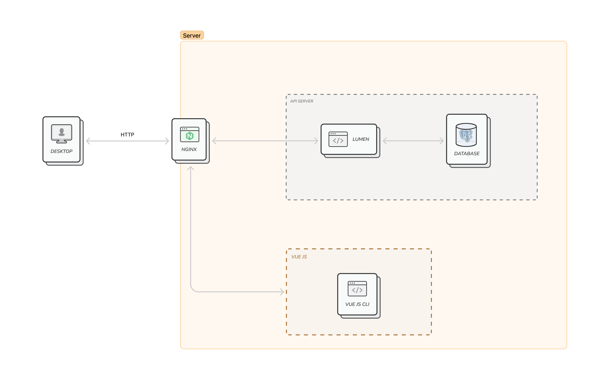
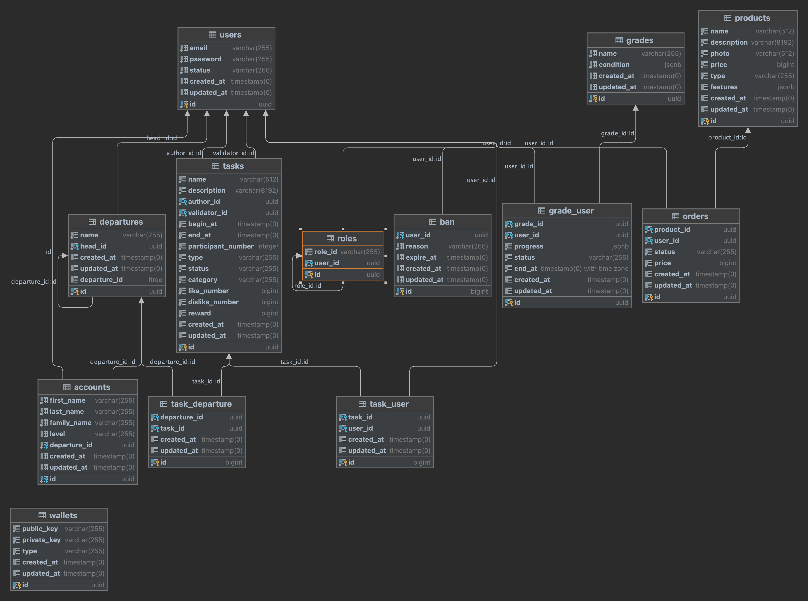
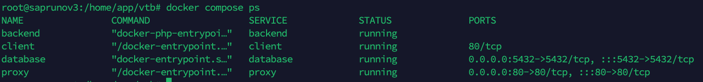

### Описание проекта
Веб-сервис для вовлечения сотрудников банка ВТБ во внутрикорпоративные активности. Сервис состоит из доски задач, личных кабинетов, магазина мерча и нфт, лидербордов, системы карьерных грейдов и кабинетов команд.
Система позволяет      
1. Со стороны Управляющих сотрудников (HR, Начальники отдела, Администратор сервиса)   
1.1 Ставить задачи для сотрудников и валидировать их выполнение.   
1.2 Управлять товарами в корпоративном магазине.   
1.3 Начислять сотрудникам монеты и НФТ сертификаты   
1.4 Задавать план развития в рамках карьерного трека в компании и указывать реперные точки   
1.5 Отслеживать статистику использования сервиса с помощью дэшбордов
2. Со стороны пользователя:     
2.1 Принимать задания, подтверждать их выполнение и получать за это награду     
2.2 Переводить цифровые рубли другим участникам     
2.3 Выводить цифровые рубли     
2.4  Переводить НФТ другим участникам     
2.5 Покупать мерч/курсы/ и др. в корпоративном магазине     
2.6 Принимать участие в командных заданиях и получать баллы на счет команды     
2.7 Смотреть и участвовать в лидербордах     
2.8 Отслеживать свой план развития и покупать рекомендуемые курсы за корпоративную валюту     

### Используемые технологии
- PHP 8.1 Lumen 9
- JS VueJS 3 Composition API
- Docker | Docker-compose
- Nginx 1.19
- PostgresSQL 

### Структура проекта
- client - содержит исходники клиентской части приложения реализованной на VueJS
- proxy - nginx сервер с конфигурационным файлов
- server - содержит исходники API приложения реализованной на Lumen 9
- stubs - содержит изображения для README.md файла
- App.postman_collection.json - Postman коллекция с API документацией
- .env.example - переменные окружения проекта
- docker-compose.yml - файл конфигурации docker container приложения

### Архитектура проложения

#### Клиентская часть
Проект написан на фреймворке Vue 3 с использованием Compoistion API и TypeScript.  
Также для разработки мы использовали npm пакеты:

- [@egalteam/widget-library](https://docs.egal.pro/#/v2/client/widgets/start_config) <- Библиотека компонентов. Использовался как основной инструмент для вёрстки.
- [@vueuse/core](https://vueuse.org/) <- Набор composoble'ов (переиспользуемых фич / методов), созданных сообществом Vue для Vue 3.
- [@vueuse/components](https://vueuse.org/) <- Дополнение к @vueuse/core. В этом пакете composoble'ы представлены в виде компонентов.
- [axios](https://axios-http.com/ru/docs/intro) <- HTTP-клиент, основанный на Promise. Использовался для интеграции с бэкендом.
- [pinia](https://pinia.vuejs.org/) <- Менеджер состояния / глобальное хранилище. Часть экосистемы Vue. Является заменой Vuex, используемой в Vue 2.
- [vue-router](https://router.vuejs.org/) <- Пакет, ответственный за маршрутизацию в SPA (Single Page Application). Так же является частью экосистемы Vue.
- [vue3-cookies](https://github.com/KanHarI/vue3-cookies) <- Пакет для более удобной работы с куками.

##### Описание страниц
###### Пользовательские страницы
- Профиль ('/'). Страница профиля пользователя. На странице отображается основная информация о пользователе, график скиллов, список задач и полученные NFT
- Команда ('/team'). Страница команды пользователя. Отображается основная информация о команде.
- Задания ('/tasks'). Страница со списком заданий для выбора. Карточки заданий можно раскрывать для более подробной информации.
- Задания ('/shop'). Страница с товарами, которые можно купить за внутреннюю валюту. Товар можно купить или подарить другому
- Задания ('/leader-board'). Доска со списком лидеров/команд месяца.

###### Администраторские страницы
- Задания ('/admin-users'). Список всех пользователей. Администратор может перевести монеты определенному пользователю с этой страницы.
- Задания ('/admin-tasks'). Список всех задач. НА странице можно создать, редактировать и удалить задачу. А также подтвердить или отклонить участников
- Задания ('/departments'). Список всех отделов. Доступны просмотр, редактирование, удаление отделов и пополнение кошелька отдела.
- Задания ('/coins'). Страница со всеми валютами в системе. Отображаются все NFT и монеты системы

#### Серверная часть
#### Общая структура
- Route system `/routes/api`
- Тонкие контролеры `/app/Http/Controllers`. Реализуют базовые стандартные CRUD endpoint `App\Http\Controllers\BaseController`
- Модели `/app/Http/Models`
- События `/app/Events`
- Слушатели `/app/Listeners`

В системе реализован event based подход, вся бизнес логика на уровне слушателей (Listeners).
Все входящие запросы обрабатываются Route system и перенаправляются на слой Controllers. В зависимости от 
действия над ресурсом (CRUD) вызывается событие модели в рамках которого выполняется Бизнес логика над данными.

#### Matic
Для работы с API блокчейном был реализован клиент `App\Http\Clients\MaticClient`, который реализуется curl запросы к API.
Для удобного использования в системе был реализован фасад `App\Facades\MaticFacade` - единая точка вызова клиента.

##### Аутентификация
В приложение используется стандартная JWT аутентификация - подпись пользовательской информации и передача ее в JWT.
Помимо стандартных полей (iat, exp и тд) добавляется информация о роли пользователя в системе

Генерация токена `App\Http\Controllers\AuthController.php`, проверка токена `App\Http\Middleware` Middleware 

### Структура БД

### Описание контейнеров
- backend - содержит PHP Lumen приложение, реализует API
- client - содержит JS VueJS приложение, реализует клиентскую часть приложения
- database - содержит PostgresSQL, СУБД приложения
- proxy - nginx, проксирует входящие запросы

### Описание работы proxy
Используется для быстрого разворачивания приложения на продакшн среде. Проксирует входящие запросы на сторону клиента `domain/` - client container
и API приложения `domain/api` - backend container

### Порядок запуска
1. Копируем содержимое файла .env.example в .env и заполняем переменные. Пример заполнения:
    - PROJECT_NAME=vtb
    - COMPOSE_PROJECT_NAME=vtb
    - DB_NAME=app
    - DB_USERNAME=user
    - DB_PASSWORD=password
    - APP_DEBUG="true"
    - APP_KEY="base64:d1k91AgNcf1g7t/SVxBwE3u4NFK/I3vMH8Gyzl2Rvrs="
    - AUTH_KEY="gzBRkDUp5jBzJ2xUirx2iJjFXY5lVZ55XPTTaFKh0y5gOEYQuvBu47ujG4n86J5K"
    - MATIC_URL="https://hackathon.lsp.team/hk"
2. Выполняем команду `docker-compose run --rm backend composer i`.
3. Выполняем команду `docker-compose up -d`.
4. Проверям работоспособность контейнеров   
   
5. Выполняем команду `docker-compose run --rm backend php artisan migrate`. Создается схема БД
6. Выполняем команду `docker-compose run --rm backend php artisan db:seed`. Приложение заполняется тестовыми данными

### Приложение
Ссылка на развернутое приложение 
- Основное приложение http://62.109.19.231/sign-in
- Админ панель http://62.109.19.231/admin

Список аккаунтов для логина
 - email edenesik@example.com | password 123456
 - email effertz.stella@example.com | password 123456
 - email marty.dooley@example.net | password 123456
 - email gtreutel@example.org | password 123456
 - email tatum.lesch@example.net | password 123456
 - email kovacek.vivien@example.org | password 123456
 - email zheller@example.com | password 123456
 - email juana.sipes@example.com | password 123456
 - email rey39@example.net | password 123456

